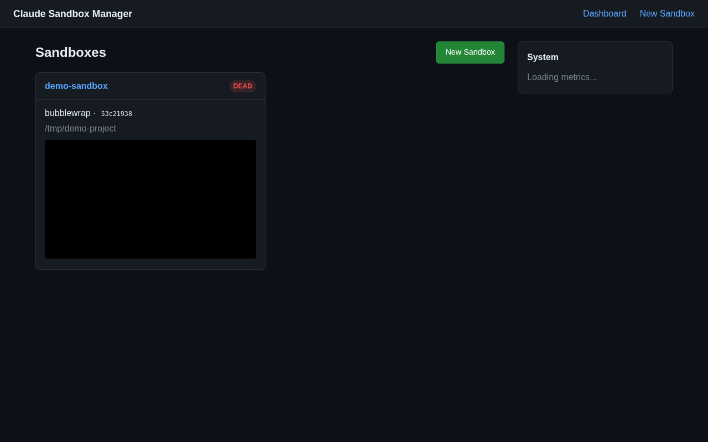
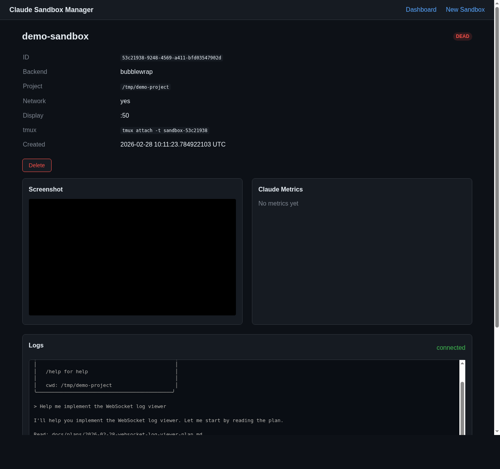

# Web Dashboard

The manager includes a web dashboard for visual sandbox management. Access it via `claude-remote ui` (SSH tunnel) or directly if you can reach the manager's listen address.

## Features

- **Sandbox list** — all sandboxes with status badges, backend type, and creation time
- **Live screenshots** — captured every 2 seconds from Xvfb or QEMU QMP
- **Sandbox detail** — individual page with live screenshot feed, Claude session metrics, and real-time log viewer
- **Real-time log streaming** — WebSocket-powered terminal view of sandbox tmux output
- **Create form** — HTML form for creating new sandboxes
- **System metrics** — CPU, memory, disk usage

## Sandbox Detail

Each sandbox detail page shows:

- **Sandbox info** — ID, backend, project directory, network status, display number, tmux session
- **Live screenshot** — auto-refreshing Xvfb or QEMU screendump
- **Claude metrics** — messages, input/output tokens, cache stats, tool uses (parsed from Claude's JSONL session files)
- **Log viewer** — real-time streaming of the sandbox's tmux output via WebSocket, with connection status indicator and auto-scroll

## Technology

The dashboard is server-rendered HTML with [htmx](https://htmx.org/) for auto-refreshing fragments. There is no JavaScript build step — htmx and CSS are vendored as static files, and HTML templates are compiled into the binary via [askama](https://github.com/djc/askama).

Log streaming uses a WebSocket endpoint (`/ws/sandboxes/<id>/logs`) that tails the sandbox's tmux pipe-pane log file and pushes new lines to connected clients in real time.

### htmx fragments

The dashboard uses htmx polling to keep content fresh without full page reloads:

| Fragment endpoint | Description |
|---|---|
| `/fragments/sandbox-list` | Sandbox list on the index page |
| `/fragments/system-metrics` | System metrics display |
| `/fragments/sandboxes/<id>/claude-metrics` | Claude session metrics for a sandbox |
| `/fragments/sandboxes/<id>/screenshot` | Live screenshot `` tag |

### WebSocket endpoint

| Endpoint | Description |
|---|---|
| `/ws/sandboxes/<id>/logs` | Real-time log stream (sends last 1000 lines as backlog, then new lines as they appear) |

### REST endpoint

| Endpoint | Description |
|---|---|
| `/api/sandboxes/<id>/logs` | Full log file as `text/plain` |

## Pages

| URL | Description |
|---|---|
| `/` | Index — sandbox list + system metrics |
| `/new` | Create sandbox form |
| `/sandboxes/<id>` | Sandbox detail — screenshot + metrics + log viewer |
